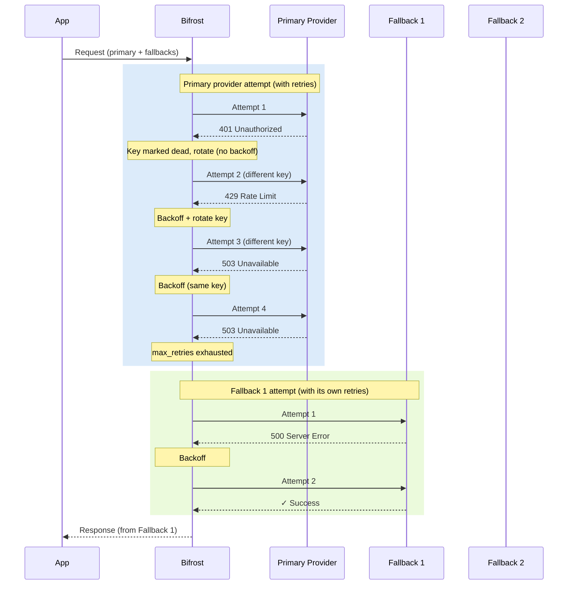

## Overview

Bifrost provides two complementary layers of resilience:

- **Retries** - When a provider returns a transient server error (network issue, 5xx) or a per-key failure (a `429` rate limit, a rejected credential, an exhausted quota, a model this key cannot reach, a retired model), Bifrost automatically retries the same request against the same provider. Transient-server retries reuse the same key with exponential backoff; per-key failures rotate to a different API key from your pool. Backoff is skipped only when rotating away from a *permanent* per-key failure where waiting offers nothing; for `429` rotations a backoff is still applied to let account-level quota windows slide.
- **Fallbacks** - When the primary provider fails after exhausting all retries, Bifrost moves on to the next provider in your fallback chain. Each fallback provider gets its own full retry budget.

Together, they let you build LLM-powered applications that stay up through rate limits, transient outages, and even full provider failures - with no changes required in your application code.

---

## Retries

### How retries work

When a request fails with a retryable error, Bifrost:

1. Classifies the failure (see [how failures are classified](#how-failures-are-classified)) as a **per-key failure** (the key or the account behind it is the problem), a **transient server failure** (the upstream is the problem: `5xx` / network / DNS), or a **request failure** (no key would have served it).
2. On **per-key failures**, rotates to a different API key from the pool (if multiple keys are configured). Two sub-cases:
    - **Permanent per-key failure** (rejected credential, exhausted quota, model this key cannot reach, retired model, region block): mark the key dead for the remainder of the request and rotate immediately with **no backoff**, since waiting changes nothing for that key. The failed attempt is not charged against `max_retries`: the budget bounds retries against a key that might recover, not the walk to the next key, so a pool is walked even at the default `max_retries: 0`.
    - **Rate limit** (`429`): mark the key as used-this-cycle and rotate, but **still apply backoff**, since providers often enforce account-level quotas shared across keys, so the new key may not have fresh capacity until the window slides.
3. On **transient server failures** (`5xx`, DNS, connection refused): reuse the same key and wait using **exponential backoff with jitter** before the next attempt.
4. Continues until the request succeeds, `max_retries` is exhausted, or every key is permanently dead. When any key was refused for the model (no access, no such deployment, retired) or for the request's location, that error is returned whichever key died last: a `404` for a model no key serves stays a `404`, and a region block comes back as the provider sent it. Otherwise every key was rejected for an account-level reason (credential, quota), and within the configured budget Bifrost returns `502 upstream_credentials_exhausted` rather than the raw `4xx`, to make it clear the caller's Bifrost API key is fine and the configured provider credentials are not; when the pool ran out on an attempt granted beyond the budget, the last upstream error is returned as is.

### How failures are classified

Every failed attempt gets a `failure_class`, recorded on the `attempt_trail` (see [Built-in Observability](/features/observability/default)) with the raw `status_code`. Where a provider exposes its own error code, type or exception name, the class is read from that rather than from the status, and from the message where it exposes nothing else, because providers disagree on which status carries which fact: Gemini rejects a bad key with a `400`, Bedrock reports a retired model as a `400 ValidationException` or a `404 ResourceNotFoundException`, Anthropic reports an empty credit balance as a `400 invalid_request_error`, OpenAI reports one as a `429`. A status alone decides only what it has always decided for the retry loop: `401`, `402`, `403`, `429` and the transient `5xx` set. A `401` or `403` marks the key dead whatever its body says, and a transient `5xx` stays a same-key retry unless its body carries rate-limit wording, exactly as before. A provider with no keys to rotate (a keyless custom provider) keeps the same-key retries these statuses have always earned.

| `failure_class` | Meaning | Retry | Key rotation |
|-----------------|---------|-------|--------------|
| `credential` | The key itself was rejected: `401` from any provider, `invalid_api_key`, Anthropic `authentication_error`, Gemini `400 INVALID_ARGUMENT` "API key not valid" or "API key expired", Bedrock's `UnrecognizedClientException` / `InvalidSignatureException` / `ExpiredTokenException` and its `AccessDeniedException` about the API key, Groq's `organization_restricted`, or a bare `403` | Yes | Permanent, no backoff |
| `quota` | The account is out of credit or over a spend cap: `402`, OpenAI `insufficient_quota` (a `429`), Anthropic "credit balance is too low" or "API usage limits" (a `400`) or "spend limit" (a `429`), Gemini "prepayment credits are depleted" or "spending cap" (a `429`), Vertex "requires billing to be enabled" (a `403`), OpenRouter "Key limit exceeded" (a `403`), Groq `blocked_api_access` | Yes | Permanent, no backoff |
| `model_access` | This key cannot reach the model: OpenAI/Groq `model_not_found` (a `404`, or a `403` when the project lacks access), Azure `DeploymentNotFound`, Groq `model_permission_blocked_*` and `model_terms_required`, Mistral `unknown_model` / `invalid_model` / `model_not_found`, Anthropic `permission_error` or `not_found_error` naming a model, Bedrock `AccessDeniedException`, `ResourceNotFoundException`, or a `ValidationException` about the model id or on-demand throughput, Gemini/Vertex `NOT_FOUND`, `PERMISSION_DENIED` or `FAILED_PRECONDITION` naming a model resource, OpenRouter "No endpoints found", a Cohere `404` naming the model | Yes | Permanent, no backoff |
| `model_gone` | The provider retired the model: Groq `model_decommissioned`, Azure `ServiceModelDeprecating` or a `410`, or a model error saying deprecated, decommissioned, retired, end of life, no longer available or removed | Yes | Permanent, no backoff |
| `region_blocked` | The provider refuses the request's location: OpenAI `403 unsupported_country_region_territory`, Gemini "User location is not supported" / "not available in your country", Anthropic on Bedrock "not allowed from unsupported countries". The block can be bound to the key rather than the gateway: Gemini refuses a free-tier project where a billed project is served from the same address, and Bedrock checks the account's billing address as well as the caller's, so the next key is tried. When the block is the gateway's own address (OpenAI checks only that), the walk ends with the provider's error after one refused call per key | Yes | Permanent, no backoff |
| `rate_limit` | Any other `429`, or a rate-limit message pattern at any status other than `401`/`403` (a `5xx` whose body says the limit was hit rotates, as it always has) | Yes | Rotate; key may be retried later in the request |
| `transient` | Network error, or `500`/`502`/`503`/`504`/`529` | Yes | No, same key |
| `caller_fault` | The request itself was refused: `400`/`409`/`413`/`415`/`422` with a provider error body and no rate-limit wording, or a `404` naming a request field (a file, a previous response). A `403` refused by a guardrail or moderation stays `credential`, since guardrails can be set per key or workspace and another key may serve the request | No | No |
| `unknown` | A `4xx` with no signal Bifrost recognises, such as a bodyless or HTML `404` from a proxy or a wrong base URL | No | No |

### Azure streaming errors before output

Azure Chat Completions and Responses streams can emit startup metadata before
reporting an error inside an HTTP `200` response. Bifrost buffers recognized
startup events so these errors can reach the existing retry and fallback logic.

- **Chat Completions:** empty-choice annotations, empty deltas, and assistant-role chunks.
- **Responses:** empty `response.created`, `response.in_progress`, `response.queued`,
  and ping events, plus empty assistant-message and output-text-part startup events.

For example, an annotation followed by an assistant-role chunk and a rate-limit
error can trigger recovery. The error does not need to occur at a particular
chunk number. Retry eligibility, retry budgets, and fallback permissions still apply.

When output arrives, Bifrost replays the successful attempt's buffered events in
order and continues streaming. Buffered events from failed attempts are discarded.
Text, reasoning, tool activity, other output, terminal results, and unrecognized
events end startup buffering. Errors after that boundary remain stream errors.
A `content_filter` finish reason remains a terminal response.

Buffering also ends when startup metadata reaches 64 chunks or 256 KiB of
serialized data. Existing request deadlines and stream idle timeouts still apply.
Raw streaming passthrough and Responses retrieval/resumption are excluded.

See Microsoft's [Azure streaming examples](https://learn.microsoft.com/en-us/azure/foundry/openai/concepts/content-streaming)
and [Responses event reference](https://learn.microsoft.com/en-us/rest/api/microsoft-foundry/azureopenai/responses).

### Provider retry hints

When a provider says how long to wait before retrying, Bifrost records it on the error as `extra_fields.retry_after_ms`, in milliseconds. It reads, in this order:

| Source | Format | Sent by |
|--------|--------|---------|
| `google.rpc.RetryInfo` detail in the error body, including an error event in a stream | duration such as `39s` | Gemini, Vertex AI |
| `retry-after-ms` header | milliseconds | Azure OpenAI |
| `Retry-After` header | seconds, or an HTTP date | OpenAI, Azure OpenAI, Anthropic, Groq, OpenRouter |

The value is clamped to between 1 second and 5 minutes, and the field is absent when the provider gave no explicit hint. Rate-limit reset headers (`x-ratelimit-reset-*`, `anthropic-ratelimit-*-reset`) are not used: they say when each limit refills, not how long a given request must wait.

```json
{
  "status_code": 429,
  "error": { "type": "tokens", "code": "rate_limit_exceeded", "message": "Rate limit reached for gpt-4o on tokens per min (TPM)" },
  "extra_fields": { "retry_after_ms": 20000 }
}
```

The same hint is recorded per attempt on the `attempt_trail` as `retry_after_ms`, so a key that was rotated away from still shows how long it asked for. The request's final error only carries the answer from the key it ended on.

The hint is informational: Bifrost's own retries still wait according to the [backoff formula](#backoff-formula) below.

<Note>
In Bifrost Enterprise, [Adaptive Load Balancing](/enterprise/adaptive-load-balancing#how-long-a-key-is-held) uses the hint as how long to hold the refused key out of rotation for later requests, never less than 10 seconds.
</Note>

### Backoff formula

Backoff applies to **same-key retries** (transient server 5xx / network errors) and to **`429` rate-limit rotations** (since account-level quotas can be shared across keys). It is skipped only when rotating away from a **permanent per-key failure** (`credential`, `quota`, `model_access`, `model_gone`) to a genuinely different key: a dead key gains nothing from waiting.

```
backoff = min(retry_backoff_initial × 2^attempt, retry_backoff_max) × jitter(0.8–1.2)
```

With the defaults of `retry_backoff_initial = 500ms` and `retry_backoff_max = 5000ms`:

| Attempt | Base backoff | With jitter (approx.) |
|---------|-------------|----------------------|
| 1st retry | 500 ms | 400–600 ms |
| 2nd retry | 1000 ms | 800 ms–1.2 s |
| 3rd retry | 2000 ms | 1.6–2.4 s |
| 4th retry | 4000 ms | 3.2–4.8 s |
| 5th+ retry | 5000 ms (capped) | 4–5 s |

### What triggers a retry

| Condition | Retried? | Key rotation? | Backoff before next attempt? |
|-----------|----------|---------------|-------------------------------|
| Network error (DNS, connection refused) | Yes | No - same key reused | Yes |
| `5xx` server errors (500, 502, 503, 504) | Yes | No - same key reused | Yes |
| Rate limit (`429` or rate-limit message pattern) | Yes | Yes - rate-limited key may be retried later in the cycle | Yes - account-level quotas may be shared across keys |
| Rejected credential (`401`, bare `403`, or the provider's own code for a bad key) | Yes | Yes - failing key marked **permanently dead** for this request | No - waiting can't revive a bad credential |
| Exhausted quota (`402`, OpenAI `insufficient_quota`, Anthropic "credit balance") | Yes | Yes - failing key marked **permanently dead** for this request | No - waiting can't refill an account |
| Model this key cannot reach, or retired model (`model_not_found`, `DeploymentNotFound`, `model_decommissioned`, Bedrock/Google model errors) | Yes | Yes - failing key marked **permanently dead** for this request; another key may serve the model | No - the key's access does not change by waiting |
| Region block (`403 unsupported_country_region_territory`, Gemini "User location is not supported", Bedrock "unsupported countries") | Yes | Yes - failing key marked **permanently dead** for this request; the block may be the key's project or account rather than the gateway | No - the key's location does not change by waiting |
| Request validation error (`400`/`409`/`413`/`415`/`422`, or `404` naming a request field) | No | - | - |
| Other `4xx` with no recognised signal | No | - | - |
| Plugin-enforced block | No | - | - |
| Cancelled request | No | - | - |

### Configuring retries

Retries are configured per-provider in `network_config`. The defaults are `max_retries: 0` (no retries), `retry_backoff_initial: 500` ms, and `retry_backoff_max: 5000` ms.

<Tabs group="config-method">
<Tab title="Web UI">

<Frame>
  
</Frame>

Navigate to **Providers**, select a provider, and open the **Network Config** section.

Set:
- **Max Retries** - number of additional attempts after the first failure (e.g. `3`)
- **Retry Backoff Initial** - starting backoff in milliseconds (e.g. `500`)
- **Retry Backoff Max** - maximum backoff cap in milliseconds (e.g. `5000`)

</Tab>
<Tab title="API">

```bash
curl --location 'http://localhost:8080/api/providers' \
--header 'Content-Type: application/json' \
--data '{
    "provider": "openai",
    "keys": [
        {
            "name": "openai-key-1",
            "value": "env.OPENAI_API_KEY",
            "models": ["*"],
            "weight": 1.0
        }
    ],
    "network_config": {
        "max_retries": 3,
        "retry_backoff_initial": 500,
        "retry_backoff_max": 5000
    }
}'
```

</Tab>
<Tab title="Go SDK">

```go
func (a *MyAccount) GetConfigForProvider(provider schemas.ModelProvider) (*schemas.ProviderConfig, error) {
    switch provider {
    case schemas.OpenAI:
        return &schemas.ProviderConfig{
            NetworkConfig: schemas.NetworkConfig{
                MaxRetries:          3,
                RetryBackoffInitial: 500 * time.Millisecond,
                RetryBackoffMax:     5 * time.Second,
            },
            ConcurrencyAndBufferSize: schemas.DefaultConcurrencyAndBufferSize,
        }, nil
    }
    return nil, fmt.Errorf("provider %s not supported", provider)
}
```

</Tab>
<Tab title="config.json">

```json
{
  "providers": {
    "openai": {
      "keys": [
        { "name": "openai-key-1", "value": "env.OPENAI_KEY_1", "models": ["*"], "weight": 1.0 },
        { "name": "openai-key-2", "value": "env.OPENAI_KEY_2", "models": ["*"], "weight": 1.0 },
        { "name": "openai-key-3", "value": "env.OPENAI_KEY_3", "models": ["*"], "weight": 1.0 }
      ],
      "network_config": {
        "max_retries": 3,
        "retry_backoff_initial": 500,
        "retry_backoff_max": 5000
      }
    }
  }
}
```

| Field | Type | Default | Description |
|-------|------|---------|-------------|
| `max_retries` | integer | `0` | Number of additional attempts after the first failure |
| `retry_backoff_initial` | integer (ms) | `500` | Starting backoff duration in milliseconds |
| `retry_backoff_max` | integer (ms) | `5000` | Maximum backoff cap in milliseconds |

</Tab>
</Tabs>

### Key rotation on per-key failures

<Note>
Key rotation on retries requires **v1.5.0-prerelease4 or later**. Rotation on auth (401/403) and billing (402) errors (in addition to rate limits) requires the retry-logic-enhancements release. Rotation on model access, retired model and region block errors, and rotation past permanent failures at `max_retries: 0`, require the failure-class release.
</Note>

When you configure multiple API keys for a provider, Bifrost automatically rotates to a fresh key when the failure is bound to the key rather than the request:

- **Rate limit** (`429`): this key is rate-limited; another may have spare quota.
- **Rejected credential** (`401`, `403`, or the provider's own code for a bad key): bad / revoked key, or key lacks permission.
- **Exhausted quota** (`402`, OpenAI `insufficient_quota`, Anthropic "credit balance is too low"): billing issue on this key's account.
- **Model this key cannot reach** (`model_not_found`, Azure `DeploymentNotFound`, Bedrock and Google model errors): no access, no such deployment, no inference profile; another key may have it.
- **Retired model** (`model_decommissioned`, "deprecated", "end of its life"): tried on the next key in case its mapping differs, then returned as the provider sent it.
- **Region block** (`unsupported_country_region_territory`, Gemini "User location is not supported", Bedrock "unsupported countries"): the block may be bound to this key's project or account (a Gemini free-tier project, a Bedrock account with an unsupported billing address), so the next key is tried; when it is the gateway's own address, the walk ends with the provider's error.

```json
{
  "providers": {
    "openai": {
      "keys": [
        { "name": "openai-key-1", "value": "env.OPENAI_KEY_1", "models": ["*"], "weight": 1.0 },
        { "name": "openai-key-2", "value": "env.OPENAI_KEY_2", "models": ["*"], "weight": 1.0 },
        { "name": "openai-key-3", "value": "env.OPENAI_KEY_3", "models": ["*"], "weight": 1.0 }
      ],
      "network_config": {
        "max_retries": 5
      }
    }
  }
}
```

**Rate-limited keys** are tracked in a per-request `used` set. Once all keys in the pool have been tried, Bifrost resets that set and starts a fresh weighted round — a previously rate-limited key may have free quota by then. With 3 keys and `max_retries: 5`, Bifrost can cycle through all three keys twice before giving up.

**Permanent per-key failures** (credential, quota, model access, retired model, region block) are different: the failing key is marked **permanently dead** for the remainder of the request and is never reset, and the attempt is granted back rather than charged against `max_retries`, so the walk to the next key happens even at `max_retries: 0`. If any key was refused for the model or for the request's location, that error is returned. If every configured key ends up permanently dead for an account-level reason (credential, quota) within the configured budget, Bifrost returns `502 upstream_credentials_exhausted` and skips any remaining retries; if the pool ran out on a granted attempt, the last upstream error is returned as is.

The walk has a cost worth knowing: a model no key can reach, including a typo in the model name, or a region block on the gateway's own address, now costs one upstream call per configured key before the error (or the fallback provider) is reached, instead of one.

<Note>
Rate-limit rotation only applies when `max_retries > 0` and more than one key is configured for the provider. Rotation past a permanent per-key failure applies whenever more than one key is configured, whatever `max_retries` is. With a single key, all retries reuse that key, and a permanent per-key failure ends the request with the provider's error (or `502` when the budget outlasts the key).
</Note>

---

## Fallbacks

Fallbacks provide automatic failover to a different provider when the primary fails after exhausting all its retries. Each fallback is tried in order until one succeeds.

### How fallbacks work

1. **Primary attempt**: Tries your configured provider with its full retry budget
2. **Fallback decision**: If the primary fails (and the error is retryable at the provider level), Bifrost moves to the first fallback
3. **Sequential fallbacks**: Each fallback provider also gets its own full retry budget
4. **First success wins**: Returns the response from the first provider that succeeds
5. **All fail**: Returns the original error from the primary provider. Exception: if a plugin on a fallback provider sets `AllowFallbacks = false` on the error (e.g. a security or compliance plugin that should halt the chain regardless of remaining fallbacks), Bifrost stops immediately and returns that fallback's error rather than continuing to the next provider or returning the primary error.

Each fallback is treated as a completely fresh request - all configured plugins (semantic caching, governance, logging) run again for the fallback provider.

### Implementation

<Tabs group="fallbacks">
<Tab title="Gateway">

Pass a `fallbacks` array in the request body. Each entry specifies a `provider/model` string:

```bash
curl -X POST http://localhost:8080/v1/chat/completions \
  -H "Content-Type: application/json" \
  -d '{
    "model": "openai/gpt-4o-mini",
    "messages": [
      {
        "role": "user",
        "content": "Explain quantum computing in simple terms"
      }
    ],
    "fallbacks": [
      "anthropic/claude-3-5-sonnet-20241022",
      "bedrock/anthropic.claude-3-sonnet-20240229-v1:0"
    ],
    "max_tokens": 1000,
    "temperature": 0.7
  }'
```

The response `extra_fields.provider` tells you which provider actually served the request:

```json
{
  "id": "chatcmpl-123",
  "object": "chat.completion",
  "choices": [
    {
      "index": 0,
      "message": {
        "role": "assistant",
        "content": "Quantum computing is like having a super-powered calculator..."
      },
      "finish_reason": "stop"
    }
  ],
  "usage": {
    "prompt_tokens": 12,
    "completion_tokens": 150,
    "total_tokens": 162
  },
  "extra_fields": {
    "provider": "anthropic",
    "latency": 1.2
  }
}
```

</Tab>
<Tab title="Go SDK">

```go
package main

import (
    "context"
    "fmt"
    "github.com/maximhq/bifrost"
    "github.com/maximhq/bifrost/core/schemas"
)

func chatWithFallbacks(client *bifrost.Bifrost) {
    ctx := context.Background()

    response, err := client.ChatCompletionRequest(
        schemas.NewBifrostContext(ctx, schemas.NoDeadline),
        &schemas.BifrostChatRequest{
            Provider: schemas.OpenAI,
            Model:    "gpt-4o-mini",
            Input: []schemas.ChatMessage{
                {
                    Role: schemas.ChatMessageRoleUser,
                    Content: &schemas.ChatMessageContent{
                        ContentStr: bifrost.Ptr("Explain quantum computing in simple terms"),
                    },
                },
            },
            // Fallback chain: OpenAI → Anthropic → Bedrock
            Fallbacks: []schemas.Fallback{
                {Provider: schemas.Anthropic, Model: "claude-3-5-sonnet-20241022"},
                {Provider: schemas.Bedrock, Model: "anthropic.claude-3-sonnet-20240229-v1:0"},
            },
            Params: &schemas.ChatParameters{
                MaxCompletionTokens: bifrost.Ptr(1000),
                Temperature:         bifrost.Ptr(0.7),
            },
        },
    )

    if err != nil {
        fmt.Printf("All providers failed: %v\n", err)
        return
    }

    fmt.Printf("Response from %s: %s\n",
        response.ExtraFields.Provider,
        *response.Choices[0].BifrostNonStreamResponseChoice.Message.Content.ContentStr)
}
```

</Tab>
</Tabs>

---

## How retries and fallbacks work together

The two mechanisms form a nested resilience loop. Retries run inside each provider attempt; fallbacks run across providers once retries are exhausted.



**Key point:** each provider in the chain - primary and every fallback - gets its own full `max_retries` budget. A primary configured with `max_retries: 3` and two fallbacks each also configured with `max_retries: 3` means up to 12 total attempts before giving up.

<Info>
The retry budget is set per-provider in `network_config`. If your fallback providers have different retry configurations, each will use their own settings.
</Info>

---

## Auditing retry and fallback decisions

Every retry transition and every fallback transition is recorded on the request's **routing engine log trail** under the engine name `core`. This is the same per-request trail that plugins like `governance`, `loadbalancing`, `routing-rule`, and `model-catalog` write to when they make routing decisions — so the chain reads end-to-end: which engine picked the primary, what the primary failed with, what core retried with, and which fallback ultimately served the response.

Entries core emits:

| Phase | Level | Shape |
|---|---|---|
| Primary failed, entering fallback loop | Info | `Primary <p>/<m> failed (<type> HTTP <code>); evaluating N configured fallback(s)` |
| Each fallback iteration | Info | `Trying fallback i/N: <p>/<m> (previous attempt failed: <type> HTTP <code>)` |
| Fallback skipped (no provider config) | Warn | `Fallback <p>/<m> skipped: missing provider config` |
| Fallback succeeded | Info | `Request served by fallback <p>/<m> (attempt i/N)` |
| Fallback halted by short-circuit | Error | `Fallback <p>/<m> failed (<type> HTTP <code>); halting further fallbacks` |
| All fallbacks exhausted | Error | `All N fallback(s) exhausted; returning primary error (<type> HTTP <code>)` |
| Retry transition (rotated key) | Info | `Retry n/N for <p>/<m> (previous attempt failed: <type> HTTP <code>; rotated key=<name>)` |
| Retry transition (same key) | Info | `Retry n/N for <p>/<m> (previous attempt failed: <type> HTTP <code>; same key=<name>)` |
| Retry transition (keyless provider) | Info | `Retry n/N for <p>/<m> (previous attempt failed: <type> HTTP <code>)` |
| Retries succeeded | Info | `Request to <p>/<m> succeeded after N retry attempt(s)` |
| Retries exhausted | Error | `Retries exhausted for <p>/<m> after N attempt(s); last error: <type> HTTP <code>` |

The failure context attached to each entry is intentionally categorical — only the error type (e.g. `rate_limit_error`) and HTTP status code. The upstream provider message is *never* included, since providers can echo back API keys, tokens, or user input. The key identifier surfaced in retry rotation notes is the user-set key **name**, not the secret value.

When core emits at least one entry on a request, it also adds itself to the request log's `routing_engines_used` field (deduped — `core` appears at most once per request even if both the retry and fallback orchestrators were involved).

---

## Real-world scenarios

**Scenario 1: Rate limiting with key rotation**

OpenAI key 1 hits its rate limit. Bifrost rotates to key 2 on the next retry - no fallback needed, the request succeeds within the same provider.

**Scenario 2: Provider outage**

OpenAI is experiencing downtime (returning `503`). Bifrost retries with the same key (transient server issue), exhausts `max_retries`, then fails over to Anthropic. Anthropic succeeds on the first attempt.

**Scenario 3: Cascading failure**

Both primary and first fallback are down. Bifrost works through each provider's retry budget sequentially until the second fallback succeeds.

**Scenario 4: Cost-sensitive fallback**

Primary: a premium model for quality. Fallback: a cost-effective alternative. Governance rules can trigger a budget-exceeded error on the primary, which cascades into the fallback chain.

**Scenario 5: Revoked credential**

OpenAI key 1 was rotated out-of-band and now returns `401`. Bifrost marks key 1 permanently dead for this request and immediately rotates to key 2 (no backoff, and no `max_retries` needed), which succeeds. Future requests will retry key 1 again: the dead-key set is per-request, not persistent. In Bifrost Enterprise, [Adaptive Load Balancing](/enterprise/adaptive-load-balancing#held-keys) remembers the refusal instead: key 1 is held out of rotation on every node, and one request checks it again after a wait. If every configured key was revoked and the retry budget outlasted the pool, Bifrost would return `502 upstream_credentials_exhausted` instead of bubbling up the raw `401` (which would falsely suggest the *caller's* Bifrost API key is the problem).

**Scenario 6: Deployment missing on one key**

Two Azure keys point at different resources; only the second has a `gpt-4o` deployment. The first returns `404 DeploymentNotFound`, which is classified `model_access`: key 1 is marked dead for this request and key 2 serves it, at `max_retries: 0`. If neither key had the deployment, the caller would get the `404` back, not a credentials error. A request pinned to key 1 by key id or name, or held on it by session affinity, has no other key to walk to and gets the `404` at once.

---

## Plugin execution

When a fallback is triggered, the fallback request is treated as completely new:

- Semantic cache checks run again (the fallback provider may have a cached response)
- Governance rules apply to the new provider
- Logging captures the fallback attempt separately
- All configured plugins execute fresh for each provider in the chain

**Plugin fallback control:** Plugins can prevent fallbacks from being triggered for specific error types. For example, a security plugin might disable fallbacks for compliance reasons. When a plugin sets `AllowFallbacks = false` on the error, the fallback chain is skipped entirely and the original error is returned immediately.

---

## Next steps

- **[Keys Management](./keys-management)** - Configure multiple API keys per provider to enable key rotation on retries
- **[Governance](./governance/virtual-keys)** - Use virtual keys and routing rules to control which providers are used
- **[Observability](./observability/default)** - Track retry counts and fallback usage in your logs
